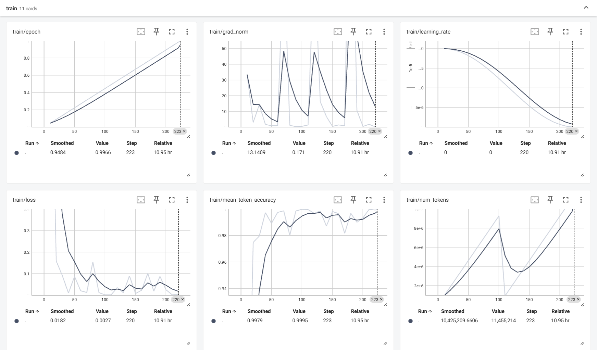

# 动物分类微调模型

## 技术栈

|          | 选择                                                         |
| -------- | ------------------------------------------------------------ |
| 模型：   | [llava-hf/llava-v1.6-mistral-7b-hf](https://huggingface.co/llava-hf/llava-v1.6-mistral-7b-hf) |
| 数据集： | [图像分类·动物图像识别与分类](https://aistudio.baidu.com/datasetdetail/140388/0) |

## 文件结构

```shell
.
├── model                           # 原始模型
├── input                           # 数据集
├── scripts                         # deepspeed配置
│   ├── deepspeed_zero3.yaml
│   └── zero3.json
├── temp                            # 数据集加载缓存
│   ├── validation.json
│   └── train.json
├── REDAME.md
├── config.py                       # 配置项
├── data_process_utils.py           # 数据集加载脚本
├── test.py                         # 测试脚本
├── train.py                        # 训练脚本
├── train.sh                        # 训练命令
├── validation.py                   # 验证脚本
└── validation.sh                   # 验证命令
```

## 数据集

- **训练集**: 14308张图片
- **测试集**: 3495张图片
- **动物类别**: 蝴蝶、猫、鸡、牛、狗、大象、马、蜘蛛、羊、松鼠

测试集无标签，可选择使用别的模型辅助打标签或从训练集剪切一部分用于测试，本项目选二

### 数据集结构

```shell
├── input
│   ├── train_data                  # 训练集
│   │   ├── butterfly
│   │   ├── cat
│   │   ├── chicken
│   │   ├── cow
│   │   ├── dog
│   │   ├── elephant
│   │   ├── horse
│   │   ├── ragno
│   │   ├── sheep
│   │   └── squirrel
│   └── validation_data             # 验证集
│       ├── butterfly
│       ├── cat
│       ├── chicken
│       ├── cow
│       ├── dog
│       ├── elephant
│       ├── horse
│       ├── ragno
│       ├── sheep
│       └── squirrel
```

## 模型

[llava-hf/llava-v1.6-mistral-7b-hf](https://huggingface.co/llava-hf/llava-v1.6-mistral-7b-hf)

参考资料：[多模态大模型应用实践（一）- 利用微调 LLaVA 实现高效酒店图片分类](https://aws.amazon.com/cn/blogs/china/multimodal-large-model-application-practice-part-one/)
         [动物分类深度学习项目](https://github.com/WorthStudy/animal-classification/tree/main)

### 训练参数

```shell

accelerate launch --config_file=./scripts/deepspeed_zero3.yaml \  # 使用 accelerate 启动训练，并指定 DeepSpeed Zero3 配置文件
    train.py \                                                    # 训练脚本入口
    --per_device_train_batch_size 4 \                             # 每个GPU上的训练批次大小
    --gradient_accumulation_steps 4 \                             # 梯度累积步数
    --output_dir sft-llava-1.6-7b \                               # 模型输出目录
    --torch_dtype bfloat16 \                                      # 使用BFloat16混合精度训练
    --gradient_checkpointing \                                    # 启用梯度检查点
    --num_train_epochs 1 \                                        # 训练轮数（自行调整），7b模型在本机（4090*4）上运行开销过大
    --save_strategy "steps" \                                     # 模型保存策略（按步数保存）
    --save_steps 100 \                                            # 每训练100步保存一次
    --learning_rate 2e-5 \                                        # 初始学习率
    --save_total_limit 5 \                                        # 最多保留5个检查点
    --lr_scheduler_type cosine \                                  # 使用余弦学习率调度器
    --weight_decay 0.01 \                                         # 权重衰减强度
    --warmup_ratio 0.03 \                                         # 预热步数占总训练步数的比例
    --optim adamw_bnb_8bit \                                      # 使用8位AdamW优化器
    --per_device_eval_batch_size 8 \                              # 每个GPU上的评估批次大小
    --logging_steps 10 \                                          # 每10步记录一次日志
    --logging_dir "./logs" \                                      # 日志存储目录
    --report_to "tensorboard"                                     # 使用TensorBoard记录日志
```

## 训练过程



## 如何开始微调

1. **安装依赖**: `pip install -r requirements.txt`
2. **下载训练集**：前往[图像分类·动物图像识别与分类](https://aistudio.baidu.com/datasetdetail/140388/0)，并将目录结构按上文整理
3. **执行训练**：`sh train.sh`
4. **查看训练过程**：`tensorboard --logdir=./logs`
